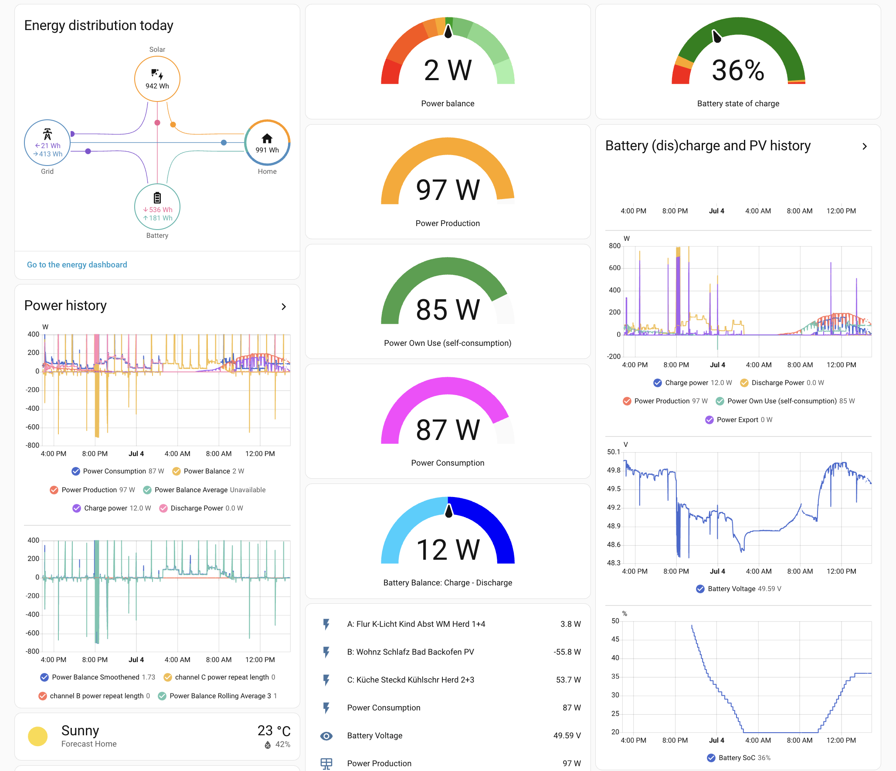

# SolBatHome

Home automation for small solar power systems, optionally with battery 
Heimautomatisierung für Balkonkraftwerke (SSG) optional mit Batteriespeicher

## Overview

This is a collection of configuration files for the
home automation software [Home Assistant](https://www.home-assistant.io/)
for tracking and optionally controlling a small solar power system.
It collects data via HTTP from a digital power metering device Shelly (Pro) 3EM
and optionally from Shelly Plus 1PM, Shelly PM Mini, or the like by HTTP and/or MQTT.
It can also collect data via MQTT and OpenDTU from a Hoymiles inverter.
By default, it uses data provided via the
[Zendure-HA](https://github.com/zendure/zendure-ha) integration
from a Zendure device such as SolarFlow 800 Plus.

The software supports optimized automatic control of an attached battery storage,
where an AC-coupled charger is controlled using an ESP8266 module
and a Hoymiles inverter controlled via OpenDTU is used for discharge.

* Adds Home Assistant configuration files for solar power system monitoring and battery control
* Provides automated charge/discharge control based on power balance, battery state, and solar forecast
* Can calculate the battery State of Charge (SoC) using the Coulomb Counting and Open Circuit Voltage methods
* Implements power balance smoothing to filter out inductive power spikes from appliances

The monitoring can be used to log per hour in a CSV file
the energy consumed and possibly produced by a PV system.
This includes also the directly used solar energy (own consumption),
the overall energy balance (net metering),
as well as the energy imported and exported (two-way metering).
In case a buffer battery is present,
also the energy charged and discharged can be included, as well as
the state of charge of the energy storage at the end of the given hour.

Moreover, all power data can be logged each second:
the balance at the distribution board per phase, the total load by the
household, as well as PV production, charge, and discharge power if present.
Also a per-minute load and PV production profile can be produced,
to use for instance with the PV and energy storage system simulator
[SolBatSim](https://github.com/DDvO/SolBatSim).

## Überblick

Dies ist eine Sammlung von Konfigurationsdateien für die
Hausautomatisierungs-Software [Home Assistant](https://www.home-assistant.io/)
zur Überwachung (Monitoring) und optionalen Steuerung einer kleinen Solaranlage.
Sie sammelt Daten per HTTP von digitalen Strommessgeräten Shelly (Pro) 3EM
und optional von Shelly Plus 1PM, Shelly PM Mini o.ä. per HTTP und/oder MQTT.
Außerdem kann sie Daten über MQTT und OpenDTU von einem Hoymiles-Wechselrichter erfassen.
Standardmäßig verwendet es Daten, die über die
[Zendure-HA](https://github.com/zendure/zendure-ha)-Integration
von Zendure-Geräten wie einem SolarFlow 800 Plus geliefert werden.

Die Software unterstützt die optimierte Regelung eines angeschlossenen Batteriespeichers,
wobei ein AC-gekoppeltes Ladegerät über ein ESP8266-Modul gesteuert wird
und ein über OpenDTU gesteuerter Hoymiles-Wechselrichter zur Entladung verwendet wird.

* Fügt Home-Assistant-Konfigurationsdateien zur Überwachung der Solaranlage und Batteriesteuerung hinzu
* Ermöglicht eine automatische Lade-/Entlade-Steuerung basierend auf Leistungsbilanz, Batteriestatus und Solarprognose
* Kann den Ladezustand der Batterie (SoC) mithilfe der Coulomb-Zählung und der Leerlaufspannungsmethode berechnen.
* Implementiert eine Glättung der Leistungsbilanz, um induktive Leistungsspitzen durch Verbraucher herauszufiltern

Mit dieser Lösung kann man die vom Haushalt verbrauchte und ggf. mit einer PV-Anlage
erzeugte Energie stundenweise in einer CSV-Datei protokollieren lassen,
inklusive des dabei erzielten PV-Eigenverbrauchs, der Gesamt-Energiebilanz,
sowie der importierten und exportierten Energie,
wie sie auch von einen Zweiwegezähler geliefert wird.
Bei Verwendung eines Batteriespeichers
kann auch die geladene und entladene Energie protokolliert werden
sowie der Ladezustand jeweils zum Ende der vollen Stunde.

Außerdem lassen sich die Leistungsdaten (Bilanz am Unterverteiler pro Phase,
saldierte Last, sowie ggf. PV-Leistung, Speicher-Lade- und Entladeleistung)
pro Tag sekundengenau protokollieren
sowie ein minutengenaues Haushalts-Lastprofil und PV-Profil erstellen,
z.B. zur Verwendung mit dem PV- und Speicher- Simulator
[SolBatSim](https://github.com/DDvO/SolBatSim).

<!--
Local IspellDict: american
Local IspellDict2: german8
LocalWords: SolBatHome Lovelace screenshot dashboard configuration SoC
LocalWords: yaml pl br pl csv Local
-->
